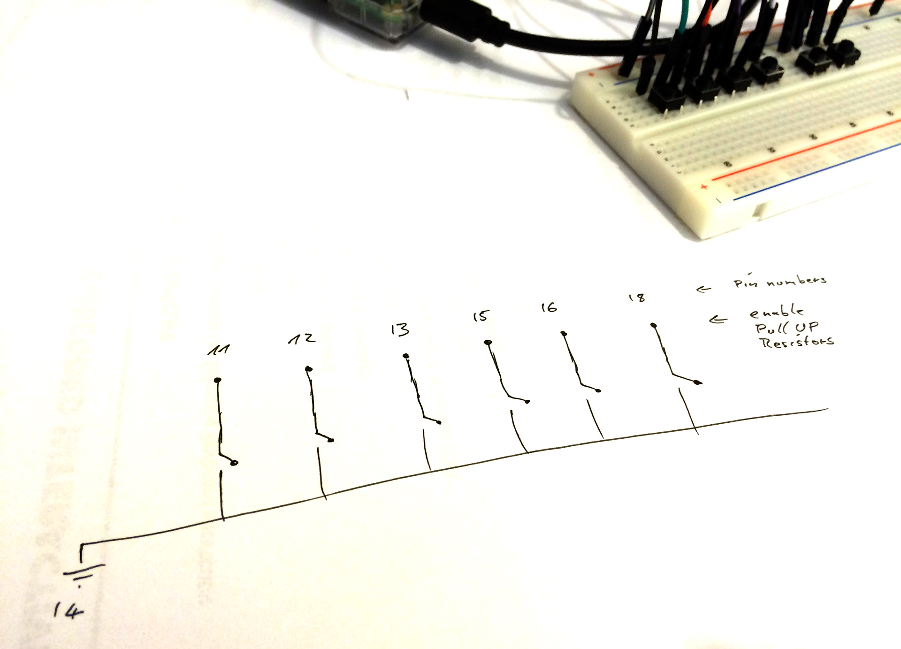
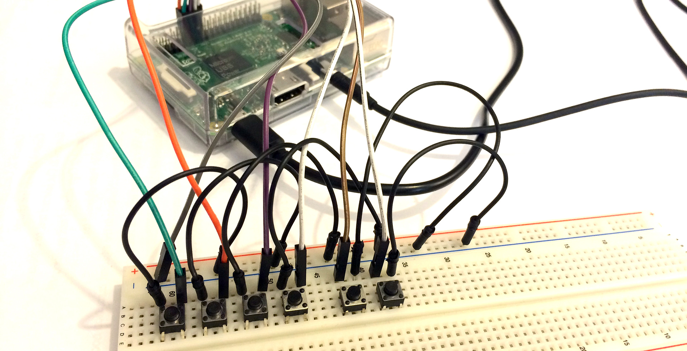
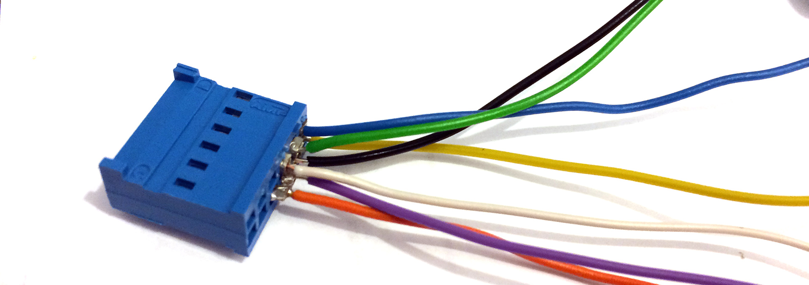
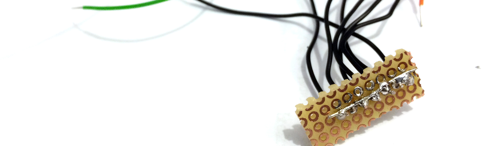

# samplebox

A little device with four buttons to play music/effect samples.

## How it works

There are four buttons. If you press one, a sound will be played. E.g. when you press the second button, the file located under `samples/02.wav` will be played.  
There is an additional "shift" button. If pressed it plays other sounds. E.g. pressing the second button with shift pressed, `samples/06.wav` is played.  
The sixth button is a "control" button. If you press the first button with control held, we increase volume. The second button makes following sounds quieter and the fourth button shuts the whole system down.

## Circuit

The very simplistic circuit looks like this:



I first started on a breadboard:


Then I moved on to soldering the whole stuff together:




## Installation

We tested with a Raspberry PI 2 with [Raspbian](https://www.raspberrypi.org/downloads/raspbian/) Jessie (lite image). Please ssh onto the machine:

```bash
sudo dpkg-reconfigure locales # choose your keyboard layout and language (I prefer en_US.UTF-8)
# install dependencies
sudo apt-get install python3 python3-pygame python3-rpi.gpio
# install debugging/convenience packages
sudo apt-get install raspi-gpio mplayer vim
# download repo
cd
git clone https://github.com/motine/samplebox.git
# If you want the playbox come up automatically after boot, install it as a systemd service
sudo cp samplebox/systemd/samplebox.service /etc/systemd/system/
sudo systemctl daemon-reload
sudo systemctl enable samplebox
sudo systemctl start samplebox # start the service immediately
sudo systemctl status samplebox # check its status
# download sounds
cd ~/samplebox/samples
# see below
sudo systemctl restart samplebox # reload the new samples
```

Now you can **need add sounds, because the ones provided here are just silence**. To add/change sounds, please create files in the `samples` folder.
Their filename should be a number between 1 and 8 with a leading 0. After changing samples, please restart the service (see above).
The sound files must be uncompressed wav files. Example filename: `samples/01.wav`.

For example, please see [this site](http://www.orangefreesounds.com/category/sound-effects/funny-sounds/page/2/) to download sound effects.

## Development

Please see [README.Development](README.Development.md) for more details on the software part of this project.

